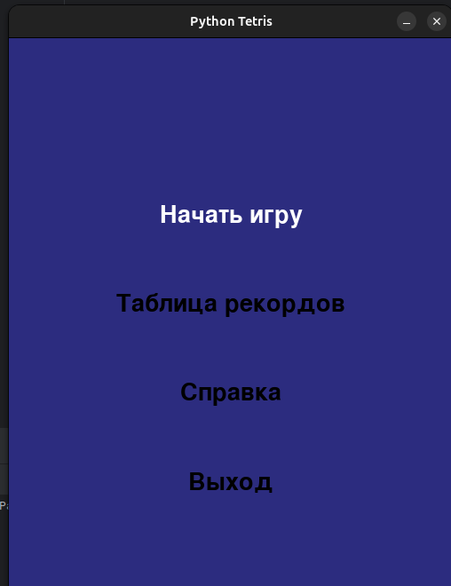
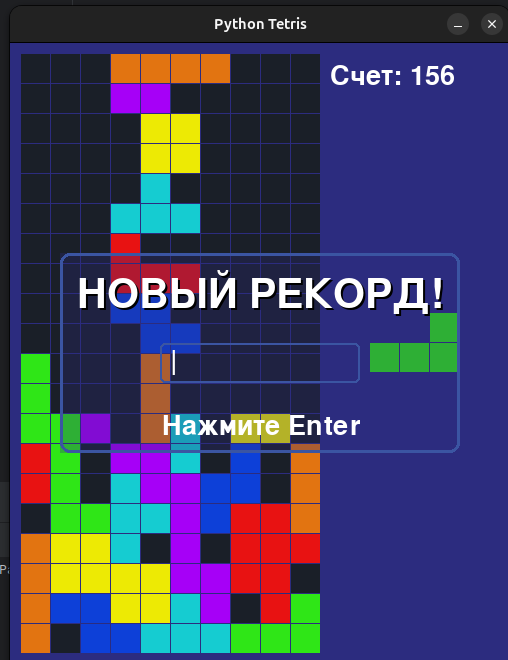
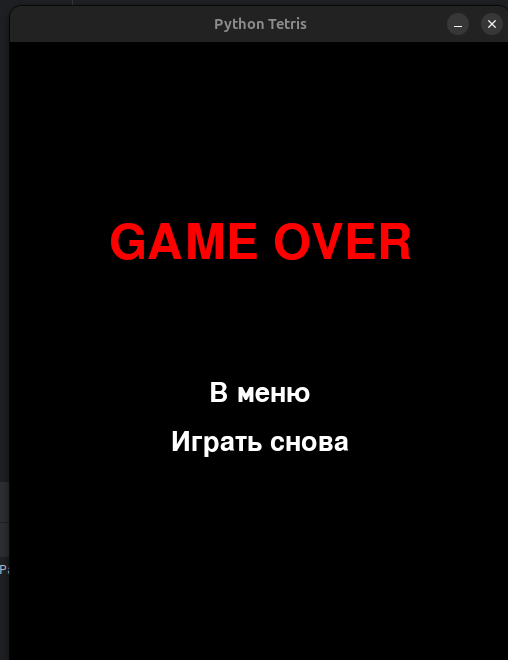

# tetris_pygame_app

Tetris Game with Pygame


## Installing
Download the Python 3 installer package from the official website and install it, if not installed previously.

Run the following in the terminal to install the Pygame library
```
pip3 install pygame
```


Another alternative would be to import the contents of the repository in a PyCharm project.
The Pygame library can be installed in a virtual environment of PyCharm using the steps mentioned [here](https://www.jetbrains.com/help/pycharm/installing-uninstalling-and-upgrading-packages.html).


## Running the application
Download the source code from the repository and run the file just as any other Python script (.py) file.
```
python3 main.py
```

## Project structure
```
tetris_pygame_app/
│
├── config.json
├── main.py             
├── game.py             
├── grid.py              
├── block.py          
├── blocks.py   
├── position.py          
├── colors.py       
├── menu.py
├── highscores.py 
├── dialog.py    
│
├── Sounds/       
│   ├── rotate.ogg
│   ├── clear.ogg
│   ├── GameOver.ogg
│   └── music.ogg
│
└── img/                
    ├── main.png
    ├── game.png
    └── game_over.png
```

## Screenshots


*Startup screen*


*Active game screen*


*Game over screen*

## documentation
* [Python](https://www.python.org)
* [Pygame Documentations](https://www.pygame.org/docs/)
